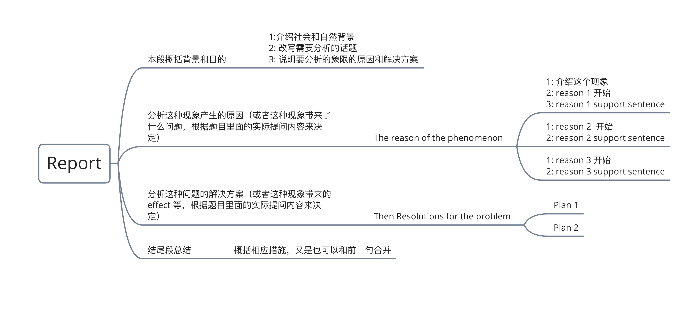
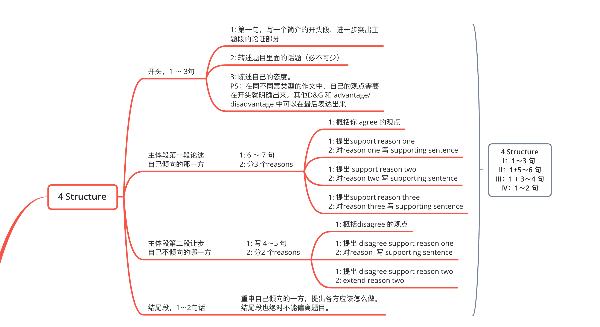
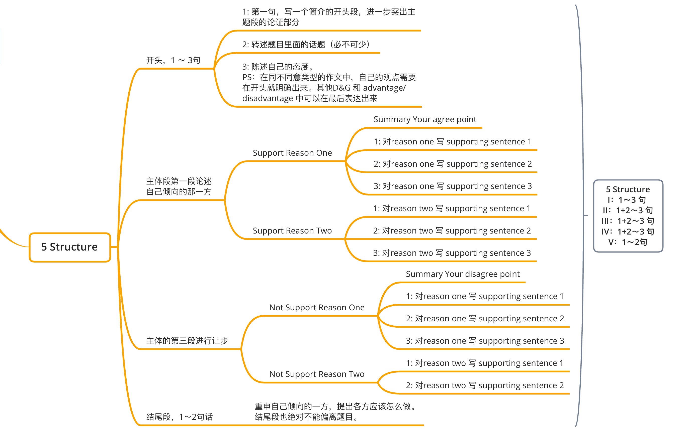

## Summary Writing

### Day 2
- 简单句
- 并列句
- 复杂句

### Day 3
- 不要用错词
- 背句子
- 准确的表达出意思，比用复杂句要好上很多

### Day 4 
  #### 判断文章的类型 （ Argument or Report）

### Day 5
 
Skill        &     Efficiency   
Technology   &     Safety  
Right        &     Responsibility  
Environment  &     Health  
Employment   &     Money  
Culture      &     Fun

Day6
### Use linking words that you fully understand and can use accurately. Avoid using linking words tha you only partially understand

Not every sentence needs to start with a linking word.