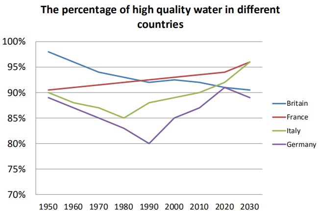

The char bar illustrate the percentage of high quality water in 5 countries between 1950 to 2030

Britain had the highest quality water between 1950 to 1980. Around 6 % higher than other countries.Franc and Italy had beyond the Britain in 1980 and 2010. In contrast, The figures for Germany remained the lowest throughout the period which fell to the lowest level in 1990 at 80%.

the water quality in all these countries except for Britain improves, with figures rasing to varying degrees by 2030

### 折线图
The line graph illustrates the  passenger railway journeys in Great Britain and all they were a show an upward trend in between 1950 and 2004/05

The number of people had dropped slightly in the subsequent years which it was reaching a peak of 1.1 billion just before the 1960s
The figure for the national railway dropped steadily from around 1.1 billion to 730 million and then hit the lowest point after 1980. compare to the figure for London Underground which had around 740 million passengers in 1950s was only two-thirds of those taking national rail network After this, the number remained steadily for the 20 years, followed by a fall slightly and hit the lowest point 490 million after in 1980, however, The figure showed an upward trend after several years and similar pattern as the to the national rail network, both had the highest level in 2004/5

on the other hand, after their introduction in the 1960s, the light rail and metro systems carried a part of passengers and then had an upward trend. Nonetheless, in  1980, there was a marginal increase in the number of journeys made by passengers, reaching nearly 200 million in 2004/05

Beginning in 1959, the price of beef remains stable in 22, which in 1995 had risen dramatically to 55 every week—increased 50% in 20 years. Compares to the price of fish it experienced fluctuation around 22 in 20 years and show a downward trend in the future.

### 柱状图
The graph show three different sector workforce in Japan, Brazil and india. The figures for agriculture sector in india is more higher than the other two countries.

Starting at is the highest one in the three countries on service sector which 3 times more than india and 20 % than Brazil

Starting at Japan which a is service sector more than two the other countries, three times more than india and 20% more than Brazil.

as far as concern about india, The figures for agricultural sector is more than 7 times
Japan and more than 50% Brazil.As we know, India

----
The proportion shows the worker in three different sectors between 
developing country and developed country.

As far as concerned, India is one of developing country in the world which had large of population and agricultural is the first production in India which is 7 times more than Japan and more than 2 times than Brazil However, the figure for the industrial sector is opposite of the agricultural sector. 3% of workers in the industrial sector for Japan 3 times than India and 10% more than Brazil. 

Just like the industrial sector data, In Japan, the figures for the service sector had a similar pattern to the industrial sector, which is 20% more than Brazil and 40% more than India.

----

As far as concerned, India is one of developing country in the world which had large of population and agricultural is the majority of the Indian worker which is 7 times more than Japan and more than 2 times than Brazil. However, the proportion for the industrial sector is the opposite of the agricultural sector,30% of workers in Japan, around 25% of workers in Brazil and merely 10% of workers in India. 

In Japan, the figures for the service sector had a similar pattern to the industrial sector, which is 20% more than Brazil and 40% more than India. Service as the majority in Japan amounting to two-third people of its.

---- 

The proportion shows the worker in three different sectors between 
developing country and developed country.

Speaking of Japan first, service sector is a majority production which has two-thirds 
people in this sector is around 60% more than India. in additional the figures for the Brazil in service sector also 30% high than India. Around one-thirds people is working on service sector in india.As we know India is part of the a developing countries which had been lager population in agricultural sector as the figures, 70% of workforce agricultural sector, it almost three-forth people. the number of people is 7 times more than Japan and 2 times more than Brazil.

About the industrial sector of the three countries, Merely 10% of workforce in india compares to the agricultural sector almost 7 times less than it. Japan is the highest level in industrial sector almost one-third of working population work in the industrial sector that 10 % is higher than Brazil

The proportion shows the worker in three different sectors between developing country and developed country.

Speaking of Japan first, the service sector is a majority production which has two-thirds people in this sector is around 60% more than India. In additional the figures for Brazil in the service sector also 30% high than India. Around one -thirds people is working in the service sector in India. As we know, India is part of the developing countries which had the most population in the agricultural sector as the figures, 70% of workforce agricultural sector, it almost three-fourth people. The number of people is 7 times more than in Japan and 2 times more than in Brazil.

About the industrial sector of the three countries, Merely 10% of the workforce in India compares to the agricultural sector. The data is almost 7 times less than agricultural sector. Japan is the highest level in the industrial sector; almost one-third of the working population work in the industrial sector that 10 % is higher than in Brazil.